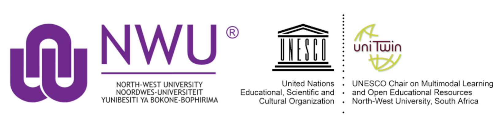

Applications are now closed.

<em>Notification of outcomes: 15 March 2022</em>

### Contents

1. [Introduction](#introduction)
2. [Programme aim](#programme-aim)
3. [What constitutes a DH OER?](#what-constitutes-a-dh-oer)
4. [What does the programme include?](#this-12-month-programme-involves-the-following)
5. [What can you gain from this fellowship?](#what-can-you-gain-from-this-fellowship)
6. [Eligibility](#eligibility)
7. [Process](#process)
8. [FAQs](#faqs)
9. [Timeline](#timeline)
10. [Contact details](#contact-details)
11. [Additional information](#additional-information)

### Introduction
*\[<a href="#top">Back to top</a>\]*

Scholars from South African universities are invited to apply to participate in the Digital Humanities Open Educational Resources (OER) Champions Initiative. This is an ideal opportunity for researchers, lecturers, and postgraduate students interested in including new online resources in their teaching or adapting their resources to their students' specific contexts to receive support and funding for creating or adapting open learning content and researching the process.

This is an initiative of the South African Centre for Digital Language Resources (SADiLaR) through the <a href="https://escalator.sadilar.org/" target="_blank">ESCALATOR Digital Champions Initiative</a> and the <a href="https://education.nwu.ac.za/UNESCO-chair-OER" target="_blank">NWU UNESCO Chair on Multimodal Learning and Open Educational Resources</a>.

### Programme aim
*\[<a href="#top">Back to top</a>\]*

The programme aims to stimulate activism and research around the use and/or creation of OER for the digital humanities (DH) at universities in South Africa.

  

    <iframe src="https://www.youtube.com/embed/HJCS3qZvDR4" title="YouTube video player" frameborder="0" allow="accelerometer; autoplay; clipboard-write; encrypted-media; gyroscope; picture-in-picture" allowfullscreen
      style="position:absolute;top:0;left:50%;
      width:100%;height:100%;">
    </iframe>
  

 

The first part of the programme involves an online short course on OERs, which includes webinars and workshops, as well as a space to share best practices. The programme will also include support for champions from the humanities to research the process, participate in a colloquium on their research and work towards a publication on their work.

OER are “learning, teaching and research materials in any format and medium that reside in the public domain or are under copyright that have been released under an open license, that permit no-cost access, re-use, re-purpose, adaptation and redistribution by others” (UNESCO, 2019). Open textbooks are good examples of OER.

For other examples of OERs, please see:

- <a href="https://www.oercommons.org/" target="_blank">https://www.oercommons.org/</a>
- <a href="hhttp://www.dot4d.uct.ac.za/" target="_blank">http://www.dot4d.uct.ac.za/</a>
- <a href="hhttps://www.merlot.org/merlot/" target="_blank">https://www.merlot.org/merlot/</a>

You can also learn more on the ESCALATOR <a href="https://www.youtube.com/playlist?list=PLAWb55M7X2CGnlbEBkSBtFhmde9aD7P7L" target="_blank">Explorer Track YouTube playlist about open educational resources</a>.

### What constitutes a DH OER?
*\[<a href="#top">Back to top</a>\]*

For this programme we will consider any OER localised to the South African context and could contribute to the development of skills related to digital humanities. This may include textbooks, tutorials, videos, and other resources used in an educational context. The programme will support the development of new OER and localisation of existing OER content adapted from materials available, for example, in the Global North.

Since the field of digital humanities is still in its infancy in South Africa, we recognise a need for foundational educational resources related to general computational thinking and digital scholarship for humanities and social sciences. Therefore, projects related to the adaptation of such foundational materials from other disciplines for the humanities will also be considered.

### This 12-month programme involves the following:
*\[<a href="#top">Back to top</a>\]*
- A grant of R20 000 per project for individuals or groups working to develop OERs that will support the growth of DH capacity and related skills in South Africa (adaptation, text editing, and/or research expenses)
- Opportunities to attend workshops on DH OERs, open licensing, and open pedagogy
- Discussion sessions to relate general OER sessions to the DH context
- Support to create or adapt open educational resources such as open textbooks, online tutorials, wikibooks, or combinations of open learning objects
- Support and workshops on how to research DH OERs and write up the research
- Commitment of approximately 4 - 10 hours per month depending on the project's scope.

### What can you gain from this fellowship?
*\[<a href="#top">Back to top</a>\]*
- Expertise in creating and/or adapting DH OERs
- Capacity for researching the process of using, creating, and/or adapting DH OERs
- Networking opportunities with the broader DH community in South Africa and beyond
- Recognition and acknowledgment for your work
- Resources you develop will be promoted on local and international platforms
- Skills exchange with others and support to develop your online profiles
- An opportunity to co-develop this program by sharing feedback.

### Eligibility
*\[<a href="#top">Back to top</a>\]*

- Applicants can apply as individuals or in teams of up to 5 (if you want to enter a bigger team, please [get in touch](#contact-details)
- The lead applicant and at least 50% of the project team should be affiliated with any public university in South Africa (we aim to select 1 project per university)
- Applicants can include researchers, lecturers, postgraduate students (Masters, PhD), postdoctoral research fellows, librarians, archivists, and other university staff
- Teams can include members affiliated with non-academic institutions such as National Libraries, NPOs, NGOs, civil tech organisations, etc. 
- Applicants should be able to commit to attending training and scheduled meetings (we anticipate between 4 - 10 hours a month, depending on the type of project submitted)
- Projects can include participants from humanities/social sciences/computational fields/libraries/... but OER projects must have the aim to grow Digital Humanities capacity in South Africa
- Each group member must have support from their line manager/supervisor/institution to participate in the programme to ensure they can commit time and attention to the activities.

### Process
*\[<a href="#top">Back to top</a>\]*

Up to 26 projects will be accepted for the 2022/2023 intake. Applicants can apply as individuals or teams of up to 5 members from a single institution or across institutions. Team members may include people not based at South African universities, provided that the project lead and at least 50% of the team are based at a South African university. The grant will be paid out to the project lead, and they will be responsible for further distribution and reporting.

Ideally, we hope to support at least one project led by a representative from the 26 South African public universities in 2022/2023.

Applications will be evaluated by a panel consisting of the UNESCO Chair on Multimodal Learning and Open Educational Resources Executive Committee and representation from ESCALATOR/SADiLaR. Applicants may be invited to provide more information about their project via an online meeting. The panel's decision is final. Feedback will be provided by or on 15 March 2022.

If successful, a line manager will have to endorse participation in this programme.

### FAQs
*\[<a href="#top">Back to top</a>\]*

We've started to compile a list of frequently asked questions based on questions we've received from the community.

Please view the [FAQs online](https://docs.google.com/document/d/1KB5XvP5uVDDmCh27Ke2gVy3bhyCl4M3A7ltGLe8RxLE/edit#).

### Timeline
*\[<a href="#top">Back to top</a>\]*

|Date                          | Activity                              |
|------------------------------|---------------------------------------|
|September - November 2021     | Programme proposal and budget planning|
|December 2021 - February 2022 | Advertisement of programme            |
|28 February 2022              | Applications close                    |
|1 - 14 March 2022             | Selection process                     |
|15 March 2022                 | Feedback to applicants                |
|April/May 2022                | Orientation general meeting           |
|April - November 2022         | Short learning programme              |
|April 2022                    | Individual meetings                   |
|15 May 2022                   | OER proposal submission               |
|June 2022                     | Feedback colloquium                   |
|August 2022                   | Individual meetings                   |
|November 2022                 | Final reflective colloquium           |
|December 2022 - June 2023     | Open publication of an OER            |
|December 2022 - June 2023     | Submission of research publication    |

### Contact Details
*\[<a href="#top">Back to top</a>\]*

We invite you to <a href="https://join.slack.com/t/dhcssza/shared_invite/zt-o3s8i5f7-JzA3rSdUNFMQM6BxXEnyxA" target="_blank">join our Slack workspace</a> and ask questions in the #champions-educator-track channel. Please read our <a href="https://escalator.sadilar.org/post/connect-with-the-community/" target="_blank">blog post</a> for more information about the Slack workspace.

You can also contact the following people directly via email:

- Prof Jako Olivier: <a href="mailto:Jako.Olivier@nwu.ac.za" target="_blank">Jako.Olivier@nwu.ac.za</a>
- Anelda van der Walt: <a href="mailto:escalator@talarify.co.za" target="_blank">escalator@talarify.co.za</a>

### Additional Information
*\[<a href="#top">Back to top</a>\]*

Research has shown that OERs can open up access to education and promises to provide avenues towards empowering academics towards embracing openness in education within the humanities. Furthermore, OERs offer opportunities for content localisation and bringing in student voices in terms of humanities learning content. This programme aims to empower university lecturers to become change agents in their universities towards promoting the use, adaptation and/or creation of OERs.

This programme will be hosted and managed from North-West University’s UNESCO Chair on Multimodal Learning and OERs. In this regard, this programme will link with Chair’s aim to focus on networking, building capacity and promoting research nationally on these areas in South Africa, which can also be related to the research undertaken internationally. In terms of UNESCO's Medium-Term Strategy for 2014-2021, this Chair supports the aims set out for Strategic Objective 1 (Developing education systems to foster quality lifelong learning opportunities for all) in terms of the focus on OERs and multimodal learning as vehicles towards developing open education systems. In addition, the specific focus on OERs also contributes towards realising Strategic Objective 9 (Promoting freedom of expression, media development and universal access to information and knowledge) by opening up access to information and knowledge.

Furthermore, the aims of the Chair relate to UNESCO's Sustainable Development Goals: Goal 4 (Quality Education) in terms of exploring quality with regards to the implementation of OERs in support of multimodal learning as well as Goal 10 (Reduced Inequalities) by supporting open and distance learning initiatives within South Africa.

#### Key programme objectives

The following objectives are set for this programme:
- informing champions about the practices in the use, adaptation or creation of and research on OERs for DH;
- supporting champions to openly publish an OER and embed that through open pedagogy;
- supporting the establishment of champions to promote OERs for DH at different higher education institutions;
- providing support towards OERs for DH research practices; and
- creating an opportunity for scholarly discourse around OERs for DH as well as related research.

#### Background and rationale

This programme is based on the OER Research Fellowship for university lecturers in North America as organised by the <a href="https://openedgroup.org/fellowship" target="_blank">Open Education Group</a>. Currently, no such fellowship exists in Africa. Their research focus is on “the impact of open educational resources on the cost of education, student success outcomes, patterns of usage of OER, and Perceptions of OER” (OEG, 2019). However, in the South African context, it is suggested that themes be determined from participants through colloquiums. This programme will be based on the highly successful NWU OER Fellowship that commenced at the NWU in 2020.

The rationale for this programme is to stimulate not only the use, adaptation and/or creation of OERs in South Africa, but also to create a network of scholars working in this area; give acknowledgement of the work already being done as well as initiate and support research in terms of OERs.

#### Capacity building

An essential element of this programme is to empower lecturers at universities to use, adapt and/or create OERs and do research in this context.

#### Preliminary short course content/workshop planning

- Introduction to openness and OER
- Finding and evaluating OER
- Open licensing: Creative Commons
- Open education and the digital humanities
- Student participation in open education and metaliteracy
- Open-source authoring tools for open practices
- Localization of OER
- Quality assurance of OER 
- Researching OER and open practices

*\[<a href="#top">Back to top</a>\]*

