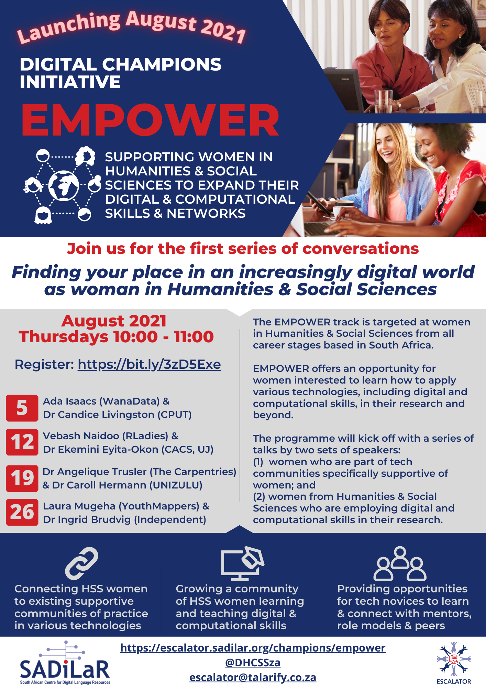
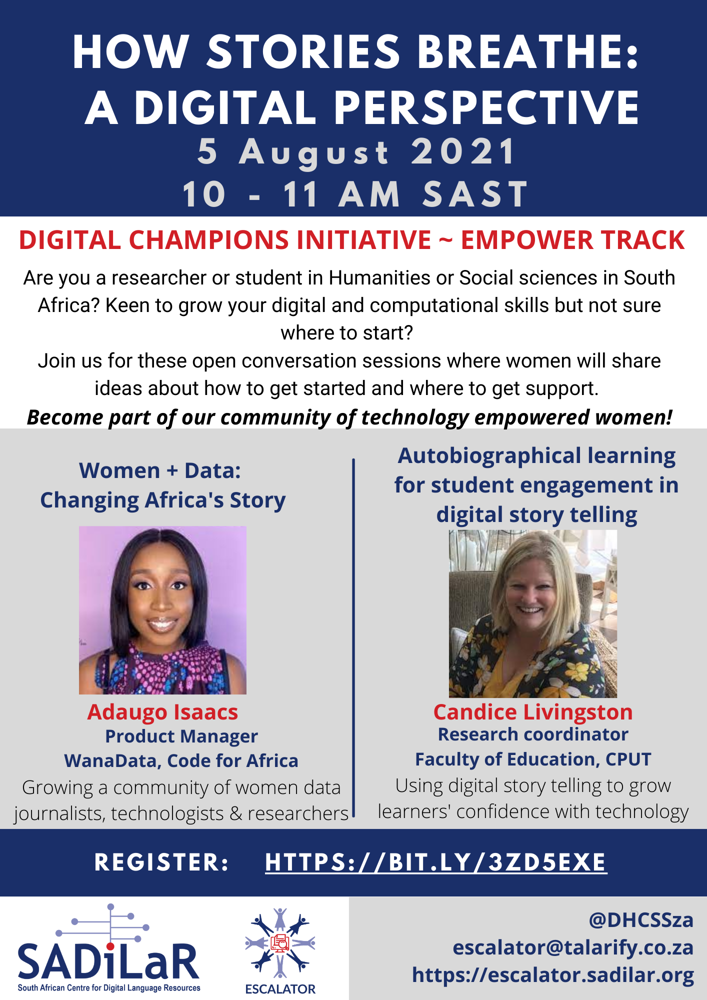

### WHAT

To get this track started in 2021, we'll kick off during women's month (August) with a series of talks by women who are involved in tech communities and women who are currently using various forms of digital and computational skills in their own research and teaching. A second series will be run during March 2022 to coincide with International Womens' Day.

The presentations will be followed by a question and answer session where audience members will be able to speak to the presenters and other community members about the topic.

### WHO

All sessions are open to women who are currently involved in humanities or social sciences research or teaching at any of the public universities or research councils in South Africa. Social sciences and humanities undergraduates are welcome too!

__No previous experience with digital scholarship or computational research required__. We welcome anyone interested to learn more!

### REGISTER

Registration is now open on EventBrite. All presentations can be attended online at no cost. 

Please register __[online](https://www.eventbrite.com/e/finding-your-place-as-woman-in-an-increasingly-digital-world-tickets-164179915547)__.

### SCHEDULE

<table class="tg">
<thead>
  <tr>
    <th class="tg-0thz">Date</th>
    <th class="tg-fymr">Day</th>
    <th class="tg-fymr">Time</th>
    <th class="tg-fymr">Topic</th>
    <th class="tg-fymr">1st Speaker</th>
    <th class="tg-fymr">Affiliation</th>
    <th class="tg-fymr">2nd Speaker</th>
    <th class="tg-fymr">Affiliation</th>
  </tr>
</thead>
<tbody>
  <tr>
    <td class="tg-f975">5 August 2021</td>
    <td class="tg-0pky">Thursday</td>
    <td class="tg-0pky">10:00-11:00 SAST</td>
    <td class="tg-0pky"><a href="https://www.eventbrite.com/e/finding-your-place-as-woman-in-an-increasingly-digital-world-tickets-164179915547" target="_blank">How Stories Breathe: A Digital Perspective</a></td>
    <td class="tg-0pky"><a href="https://www.linkedin.com/in/adaugoonyebuchi/" target="_blank">Adaugo Isaac</a></td>
    <td class="tg-0pky"><a href="https://medium.com/wanadata-africa/about-us-a4c53027b716" target="_blank">WanaData</a></td>
    <td class="tg-0pky"><a href="https://sites.google.com/view/drcandicelivingston/home" target="_blank">Dr Candice Livingston</a></td>
    <td class="tg-0pky">Research coordinator, <a href="https://www.cput.ac.za/academic/faculties/education/" target="_blank">Faculty of Education, Cape Peninsula University of Technology</a></td>
  </tr>
  <tr>
    <td class="tg-f975">12 August 2021</td>
    <td class="tg-0pky">Thursday</td>
    <td class="tg-0pky">10:00-11:00 SAST</td>
    <td class="tg-0pky"><a href="https://www.eventbrite.com/e/finding-your-place-as-woman-in-an-increasingly-digital-world-tickets-164179915547" target="_blank">R for Humanities and Social Sciences</a></td>
    <td class="tg-0pky"><a href="https://education.rstudio.com/trainers/people/naidoo+vebashini/" target="_blank" rel="noopener noreferrer">Vebash Naidoo</a></td>
    <td class="tg-0pky"><a href="https://rladies.org/" target="_blank" rel="noopener noreferrer">RLadies</a></td>
    <td class="tg-0pky"><a href="https://www.linkedin.com/in/ekemini-eyita-okon-10b77a76/" target="_blank" rel="noopener noreferrer">Dr. Ekemini Eyita-Okon</a></td>
    <td class="tg-0pky">Post-Doctoral Fellow, <a href="http://www.cacs.org.za/" target="_blank" rel="noopener noreferrer">Centre for Africa-China Studies</a> (CACS)</td>
  </tr>
  <tr>
    <td class="tg-f975">19 August 2021</td>
    <td class="tg-0pky">Thursday</td>
    <td class="tg-0pky">10:00-11:00 SAST</td>
    <td class="tg-0pky"><a href="https://www.eventbrite.com/e/finding-your-place-as-woman-in-an-increasingly-digital-world-tickets-164179915547" target="_blank">Growing tech skills as part of a community</a></td>
    <td class="tg-0pky"><a href="https://angeliquevanrensburg.com/" target="_blank" rel="noopener noreferrer">Dr Angelique Trusler</a></td>
    <td class="tg-0pky"><a href="https://carpentries.org/" target="_blank" rel="noopener noreferrer">The Carpentries</a></td>
    <td class="tg-0pky"><a href="http://www.arts.unizulu.ac.za/dr-c-hermann/" target="_blank" rel="noopener noreferrer">Dr Caroll Hermann</a></td>
    <td class="tg-0pky"><a href="http://www.arts.unizulu.ac.za/" target="_blank" rel="noopener noreferrer">Faculty of Arts, University of Zululand</a></td>
  </tr>
  <tr>
    <td class="tg-f975">26 August 2021</td>
    <td class="tg-0pky">Thursday</td>
    <td class="tg-0pky">10:00-11:00 SAST</td>
    <td class="tg-0pky"><a href="https://www.eventbrite.com/e/finding-your-place-as-woman-in-an-increasingly-digital-world-tickets-164179915547" target="_blank">TBC</a></td>
    <td class="tg-0pky"><a href="https://www.linkedin.com/in/laura-mugeha/" target="_blank" rel = "noopener noreferrer">Laura Mugeha</a></td>
    <td class="tg-0pky">Regional Ambassador, YouthMappers</td>
    <td class="tg-0pky"><a href="https://www.linkedin.com/in/ingrid-brudvig-5893a334?originalSubdomain=za" target="_blank" rel = "noopener noreferrer">Dr Ingrid Brudvig</a></td>
    <td class="tg-0pky">Independent C
    onsultant, Digital Anthropologist</td>
    
  </tr>
</tbody>
</table>

