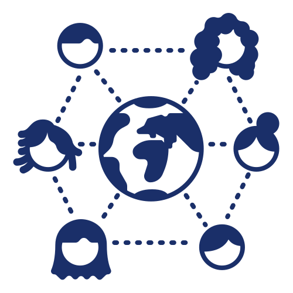

### WHAT

To get this track started in 2021, we'll kick off during women's month (August) with a series of talks by women who are involved in tech communities and women who are currently using various forms of digital and computational skills in their own research and teaching. A second series will be run during March 2022 to coincide with International Womens' Day.

The presentations will be followed by a question and answer session where audience members will be able to speak to the presenters and other community members about the topic.

### WHO

All sessions are open to women who are currently involved in humanities or social sciences research or teaching at any of the public universities or research councils in South Africa. Social sciences and humanities undergraduates are welcome too!

__No previous experience with digital scholarship or computational research required__. We welcome anyone interested to learn more!

### SCHEDULE

A draft schedule is available below and will be updated as our invited speakers confirm. Registration information will be available shortly on this site.

<table class="tg">
<thead>
  <tr>
    <th class="tg-0thz">Date</th>
    <th class="tg-fymr">Day</th>
    <th class="tg-fymr">Time</th>
    <th class="tg-fymr">Topic</th>
    <th class="tg-fymr">Organisation1</th>
    <th class="tg-fymr">Speaker1</th>
    <th class="tg-fymr">Organisation2</th>
    <th class="tg-fymr">Speaker2</th>
  </tr>
</thead>
<tbody>
  <tr>
    <td class="tg-f975">5 August 2021</td>
    <td class="tg-0pky">Thursday</td>
    <td class="tg-0pky">10:00-11:00 SAST</td>
    <td class="tg-0pky">Digital storytelling</td>
    <td class="tg-0pky"><a href="https://medium.com/wanadata-africa/about-us-a4c53027b716">WanaData</a></td>
    <td class="tg-0pky"><a href="https://www.linkedin.com/in/adaugoonyebuchi/">Adaugo Isaacs</a></td>
    <td class="tg-0pky"><a href="https://www.cput.ac.za/academic/faculties/education/">Cape Peninsula University of Technology</a></td>
    <td class="tg-0pky"><a href="https://sites.google.com/view/drcandicelivingston/home">Dr Candice Livingston</a></td>
  </tr>
  <tr>
    <td class="tg-f975">12 August 2021</td>
    <td class="tg-0pky">Thursday</td>
    <td class="tg-0pky">10:00-11:00 SAST</td>
    <td class="tg-0pky">R for Humanities and Social Sciences</td>
    <td class="tg-0pky"><a href="https://rladies.org/" target="_blank" rel="noopener noreferrer">RLadies</a></td>
    <td class="tg-0pky"><a href="https://education.rstudio.com/trainers/people/naidoo+vebashini/" target="_blank" rel="noopener noreferrer">Vebash Naidoo</a></td>
    <td class="tg-0pky"><a href="http://www.cacs.org.za/">Post-Doctoral Fellow, Centre for Africa-China Studies</a> (CACS)</td>
    <td class="tg-0pky"><a href="https://www.linkedin.com/in/ekemini-eyita-okon-10b77a76/">Dr. Ekemini Eyita-Okon</a></td>
  </tr>
  <tr>
    <td class="tg-f975">19 August 2021</td>
    <td class="tg-0pky">Thursday</td>
    <td class="tg-0pky">10:00-11:00 SAST</td>
    <td class="tg-0pky">Growing tech skills as part of a community</td>
    <td class="tg-0pky"><a href="https://carpentries.org/" target="_blank" rel="noopener noreferrer">The Carpentries</a></td>
    <td class="tg-0pky"><a href="https://angeliquevanrensburg.com/" target="_blank" rel="noopener noreferrer">Angelique Trusler</a></td>
    <td class="tg-0pky">TBC</td>
    <td class="tg-0pky">TBC</td>
  </tr>
  <tr>
    <td class="tg-f975">26 August 2021</td>
    <td class="tg-0pky">Thursday</td>
    <td class="tg-0pky">10:00-11:00 SAST</td>
    <td class="tg-0pky">Python for Humanities and Social Sciences</td>
    <td class="tg-0pky">TBC</td>
    <td class="tg-0pky">TBC</td>
    <td class="tg-0pky">TBC</td>
    <td class="tg-0pky">TBC</td>
  </tr>
</tbody>
</table>