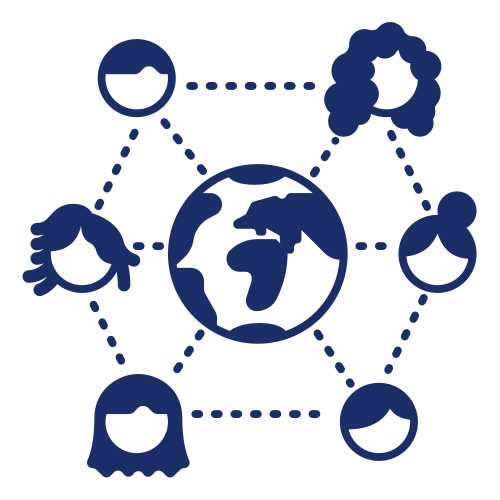

{}
In 2022 we ran a 8-step programme to help female researchers and postgraduate students in humanities, social sciences, and related fields grow their digital/computational skills. 

We developed templates that may assist with learning new tools/technologies/methodologies. 

The information below is kept for posterity.



{}

### WHO SHOULD JOIN?

All sessions are open to women currently involved in humanities or social sciences research or teaching at public universities or research councils in South Africa interested in learning new digital/computational skills.

**No previous experience with digital scholarship or computational research required**.

We welcome all women interested to learn more!

