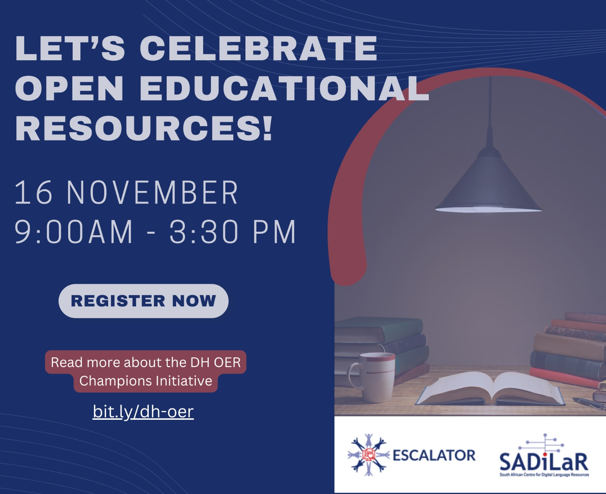



In 2022, the South African Center for Digital Language Resources (SADiLaR) launched the Digital Humanities Open Educational Resources Champions (DH-OER) programme as part of ESCALATOR.

The purpose of the initiative is to stimulate activism and research around the use and/or creation of OER for the digital humanities at universities in South Africa.

Scholars from South African universities were invited to apply to participate in the programme. The opportunity was available to researchers, lecturers, and postgraduate students interested in including new online resources in their teaching or adapting their resources to their students' specific contexts. The programme provided support and funding for creating or adapting open-learning content and researching the process.



On 16 November, project teams who completed the programme will present their OERs and share their lessons learned during the development process.

Anyone is welcome to join in, meet the project teams, learn more about OERs, how to create and use them and hear more about our project teams' experiences.

Themes:

  - Foundational literacies
  - Media Pedagogies
  - Multilingual Projects
  - Opening up Educational Practices


