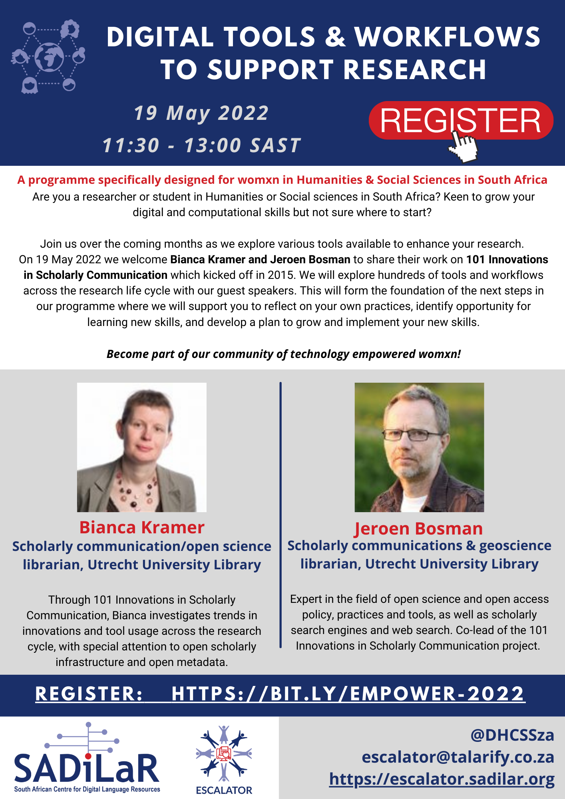

#### Presenters:

- **Bianca Kramer** *(Scholarly communication/open science librarian, Utrecht University Library)*
- **Jeroen Bosman** *(Scholarly communications & geoscience librarian, Utrecht University Library*

#### Resources from event:

- Slides: https://tinyurl.com/escalatorworkflows
- Recording: https://youtu.be/jH618mF66HM
- Templates: https://doi.org/10.5281/zenodo.6563415



#### Flyer

