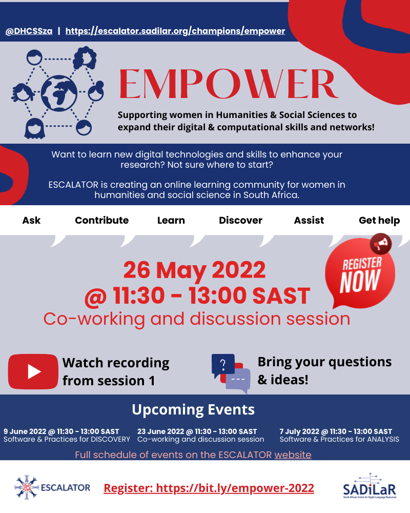

#### Resources from previous session

In preparation for this session, you are welcome to watch the recording from our first event on 19 May 2022.

- Slides: <https://tinyurl.com/escalatorworkflows>
- Recording: <https://youtu.be/jH618mF66HM>



#### Templates

You can also access our templates online:

- **Template 1:** A reflection template to support my growth in digital/computational research - <https://doi.org/10.5281/zenodo.6563415>
- **Template 2:**  A learning path template to support my growth in digital/computational research - <https://doi.org/10.5281/zenodo.656341>

