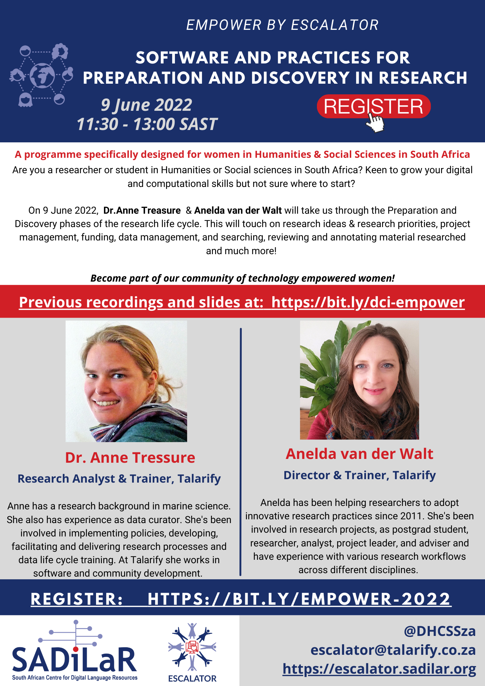



#### Preparing to start a research project

 In this session we explore tools that can be used in the research project design and development phase. We'll also look at useful tools for project management, collaboration, and more. Finally, we'll explore sources of funding open to social sciences and humanities researchers based in South Africa. Of course we'd love to hear which tools, methodologies, resources, and funding opportunities you are aware of you as well!

#### Discovering resources for research

Secondly we look at tools used in the discovery phase. Bear in mind that these phases are intertwined and seldom take place in sequential order. For discovery, we will explore how to search for literature, data, code, and other research outputs and resources. We can also look at how to read, review, and annotate research outputs.

We cannot possibly cover all the tools, technologies, platforms during the session. We introduce a few ideas across the two phases covered in this session and share information about where you can learn more.

In the [follow-up co-working session](co-working-discussion-session-23-june) on 23 June @ 11:30 - 13:00 SAST, we  discuss, explore further, ask questions, and continue to develop the learning plans [based on our templates](https://doi.org/10.5281/zenodo.6563415).

#### Resources from this session

- Recording: <https://youtu.be/HeHIh-GPAIc>
- Slides: <https://docs.google.com/presentation/d/1-yZlTiWprcXmAhH3K6rV1T-ajTWvHN-2rrn9hMMEd-8/edit#slide=id.g11eb8603442_0_30>

#### Resources from previous sessions 

##### 19 May 2022.

- Slides: <https://tinyurl.com/escalatorworkflows>
- Recording: <https://youtu.be/jH618mF66HM>

##### 26 May 2022

- Slides: [link](https://docs.google.com/presentation/d/e/2PACX-1vRPIzEAYnlTRt08M0A0zJ8jC8o5U6KQjU-5nIrAc2DFU1KUgmCO1j6WlR0FXUzlKcnhFc5Yw4PKO2i7/pub?start=false&loop=false&delayms=3000)
- Recording: <https://youtu.be/rYENh7-aYU0>

#### Templates

You can also access our templates online:

- **Template 1:** A reflection template to support my growth in digital/computational research - <https://doi.org/10.5281/zenodo.6563415>
- **Template 2:**  A learning path template to support my growth in digital/computational research - <https://doi.org/10.5281/zenodo.6563415>

#### Flyer

