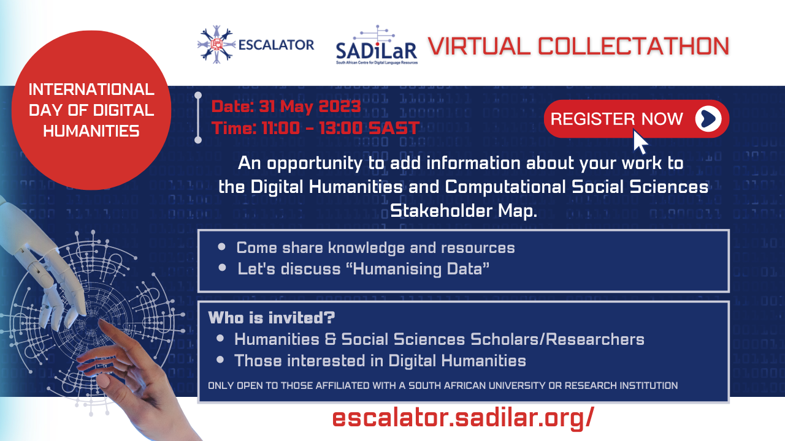

In celebration of the 2023 [International Day of DH](https://crihn.openum.ca/nouvelles/2023/05/02/day-of-dh-2023-is-on-may-31st/), themed <em>__Humanising Data__</em>,  ESCALATOR will host an __online _Collectathon_ to collect and celebrate South African projects, training, data, publications, and more__ related to computational and digital aspects of humanities and social sciences research! 



 
## What can you expect? 

- Meet peers working on digital and computational aspects of humanities and/or social sciences research projects and training; 
- Learn more about humanising data and share your thoughts on the topic; and
- Help to enhance the visibility of South African digital and computational humanities and social sciences research and training. 

The ESCALATOR _Collectathon_ is an opportunity to add information about your work to the Digital Humanities (DH) and Computational Social Sciences(CSS) [(DHCSSza) Stakeholder](https://escalator.sadilar.org/stakeholder-map/) map. The stakeholder map provides access to information about people, projects, resources, and training opportunities in the South African DH and CSS landscape. Data is openly accessible and can benefit the community in various ways, including:
- enhancing the visibility of South African research in these areas;
- providing a place to find collaborators, students, or supervisors; and
- providing funders and policymakers with pointers to gaps and opportunities and much more.

## Event details

__Date:__ 31 May 2023

__Time:__ 11:00 - 13:00 SAST

__Format:__ Virtual (meet us in Zoom)

__Registration:__ https://www.eventbrite.com/e/escalator-international-day-of-dh-collectathon-tickets-640474014017

__Programme:__

| Time | Session | Topic |
|---------|-----------------|--------------|
|11:00 - 12:00 | Part 1 | Introductions, discussion of the theme “_Humanising Data_”|
|12:00 - 13:00 | Part 2 | Collectathon** |

** Participants will help to add data to the DHCSSza Stakeholder Map by completing a Google Form that automatically populates the [interactive visualisations](https://escalator.sadilar.org/stakeholder-map/) available on the website. Alternatively, participants can assist by searching for, and sharing, relevant publications by authors affiliated with South African institutions through the [DHCSSza Zotero library](https://www.zotero.org/groups/3866799/dhcssza). 

No prior experience is needed. We will provide support and guidance!

Join us for the whole event or either part 1 or 2, whichever fits your schedule and interests!

## Who can attend this event?

Anyone in Humanities and Social Sciences or related fields or anyone from STEM fields with interest in Digital Humanities and/or Computational Social Sciences affiliated with a South African university or research institution.

## What should you bring along?

Your digital and computational humanities and social sciences curiosity, knowledge and questions and a celebratory spirit.

<em>__Join us as we share knowledge and resources and grow our community of practice!__</em>


