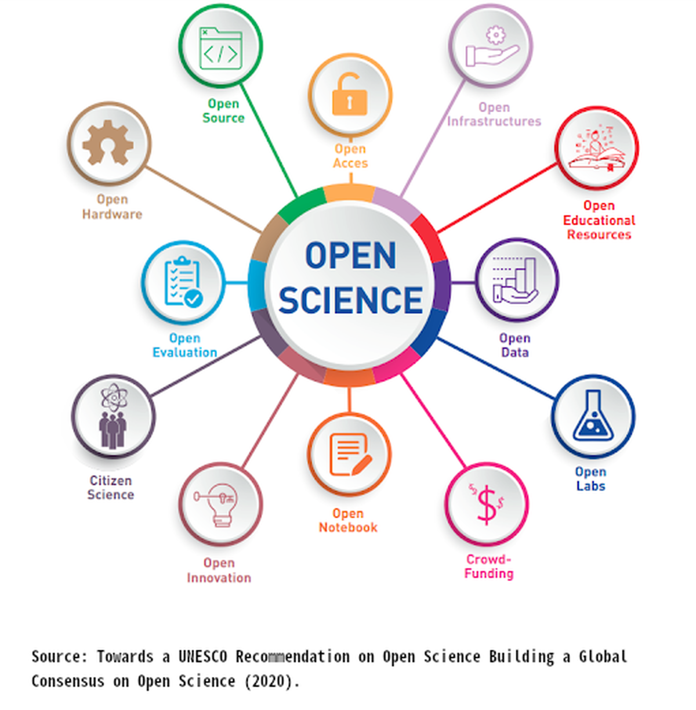
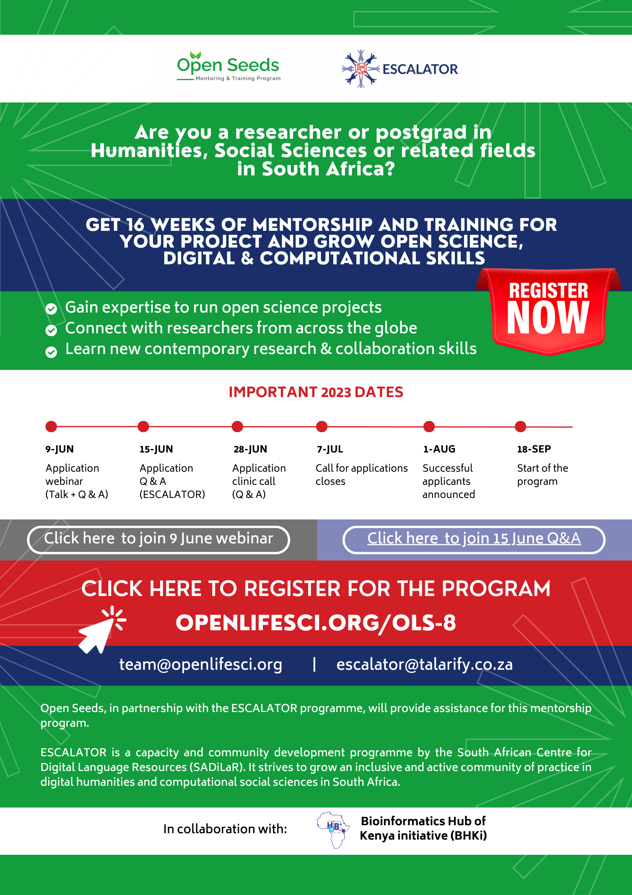

Are you a __researcher or postgraduate student__ in __Humanities or Social Sciences or related field (e.g. Education, Law, Commerce, Architecture, Libraries, etc.)__ and affiliated with a __South African university__ or public research institute? Do you have an idea for a __new project that has elements of open science and digital or computational methodologies__, but need a bit of mentorship and support to get it going?

ESCALATOR is excited to announce a new trial with the international [Open Seeds Mentorship and Training Programme](https://openlifesci.org) for their next intake! 

__Application deadline: 7 July 2023__

In this post you can:
- [read more about the Open Seeds Mentorship and Training programme](#about-open-seeds)
- [learn why this is a unique opportunity](#what-is-unique-in-cohort-8)
- [understand what kind of projects can be submitted](#what-kind-of-projects-can-be-submitted)
- [get information about upcoming Q&A sessions](#how-can-i-get-more-information) 
- [see the full timeline for applications and the programme](#what-are-the-important-dates)
- [download the flyer to share with your networks](#please-share-this-news-with-your-networks)



## About Open Seeds
---
_[[back to top]](#)_

Open Seeds is a 16-week long __mentorship and cohort-based training__, where participants (organisers, hosts, mentors and project leads/mentees) share their expertise and gain knowledge essential for running open science projects, connect with members across communities, backgrounds, and identities, and empower each other to become effective open science ambassadors in their communities. 

Participants join this program __individually or in teams__, with  projects they either are already working on or want to start developing during the program. 

The goals, learning objectives, timelines, and schedules can be found on OLS’s website: https://openlifesci.org/ols-8. 

The training programme consists of __bi-weekly training sessions__ where presenters share best practices in contemporary and open research. Topics include for example, tooling and roadmapping for open projects, project management, agile methodologies, design for inclusivity, and more. Various __skill-up sessions__ are also included in different time slots. These include for example, Github for beginners, open source software, and open leadership.

Each project is __matched to a suitable international mentor__ with whom members meet bi-weekly to discuss their projects and progress. Mentors are recruited from a broad range of research disciplines and have expertise in open science and the use of various tools and methodologies for collaboration and contemporary research.

## What is unique in Cohort 8?
---
_[[back to top]](#)_

For the next cohort intake (OLS-8) __ESCALATOR will provide additional contextualised support__ to a maximum of three project teams from South Africa who qualify according to the Open Seeds eligibility criteria and aligns broadly with the ESCALATOR focus area. Additional support will be customised based on the needs of successful projects. It may include up to __four in-person meetings with local mentors__, participation in the [DH-IGNITE conferences](https://dh-ignite.org),  additional support through the dedicated Slack workspace for the ESCALATOR community and other opportunities to network within the local and global research community.

## What kind of projects can be submitted?
---
_[[back to top]](#)_

Examples of projects that could be relevant include publishing of datasets, creating of open educational resources specific to your project or research field, publishing an online book or how-to manual under open licences, developing workflows to enhance openness in a project or department, creating data visualisations using open source tools, mapping stakeholders to grow community visibility, developing software, websites or apps, and much-much more! For examples of past projects, please visit the [Open Seeds projects site](https://openlifesci.org/about#projects).

## How can I get more information?
---
_[[back to top]](#)_

__1. Attend a webinar & Q&A with the Open Seeds team__

For more information, please join us in the incoming Open Seeds 8 application webinar on __Friday, 9 June at 12:00 - 13:00 SAST__. This call will be recorded and later uploaded to YouTube. 

  

__2. Attend a Q&A session with the ESCALATOR team__

Those who cannot participate in the first webinar and Q&A call with the Open Seeds team can join us virtually on __Thursday, 15 June at 11:00 - 12:00 SAST__. The ESCALATOR team will answer any questions about eligibility, application process, and the additional support provided through the programme.

  

__3. Attend an application clinic call with the Open Seeds & ESCALATOR teams__

Prospective applicants can join an Application Clinic Call on __Wednesday, 28 June at 19:00 SAST__. At this call, the OLS and representatives from the ESCALATOR team will be available to provide help if you have any questions related to your application. 

__4. Get in touch via email__

You are also welcome to reach out to both the ESCALATOR ([escalator[at]talarify.co.za](escalator@talarify.co.za)) and Open Seeds teams ([team[at]openlifesci.org](mailto:team@openlifesci.org)) via email, prior to these calls to ask questions related to eligibility, project proposals, and anything else you might want to know.

__5. Read the OLS-8 application guidelines and templates__

[Find a template](https://github.com/open-life-science/application-forms) in your choice of Markdown, Word, plain text, or open XML to start drafting your proposal!

## What are the important dates?
---
_[[back to top]](#)_

- __1 June, 2023__ : Call for Application opens
_See the [guidelines and templates](https://github.com/open-life-science/application-forms)_
- __9 June, 2023 (12:00 SAST)__: Application webinar (Talk +  Q&A)
_Watch recordings from previous webinars on [YouTube](https://www.youtube.com/playlist?list=PL1CvC6Ez54KBsPT0fhPtkHmBaXR4f8Dqt)_
- __15 June, 2023 (11:00 SAST)__: Application Q&A with ESCALATOR team
- __28 June, 2023 (19:00 SAST)__: Application Clinic Call (Q&A)
_At this call, OLS team will be available to provide help if you have any question related to your application_
- __7 July, 2023__: Call for applications closes.
- __1 August, 2023__: Successful applicants announced
- __18 September, 2023__: Start of the program
- __15 January, 2024__: End of the program

## Please share this news with your networks
---
_[[back to top]](#)_

The flyer can be [downloaded and shared](/media/OpenSeeds-ESCALATOR-mentorship-opportunity-2023.pdf) with others who may be interested!

