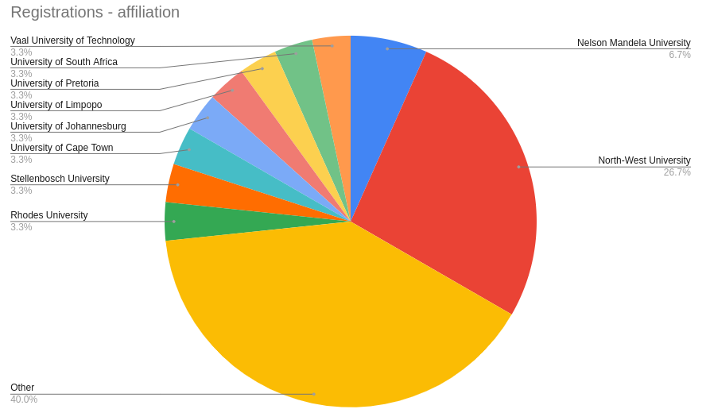
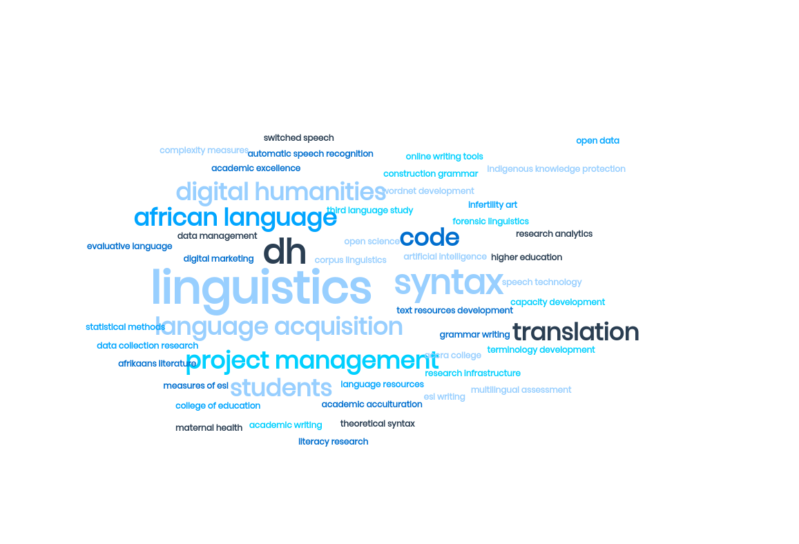

>[Open Education Week ](https://www.openeducationweek.org/) (OEW) is an  an opportunity for actively sharing and learning 
>about the latest achievements in Open Education worldwide.

On 4 March 2021, SADiLaR and ESCALATOR featured at OEW during a short presentation introducing the new capacity and community development programme.

Our two presenters were Menno van Zaanen, professor in Digital Humanities at SADiLaR, and Anelda van der Walt, ESCALATOR programme manager. Participants represented ten public universities in South Africa and several international organisations. 

Despite short notice a total of 31 participants registered of whom 20 were able to join the event. Below is a wordcloud (generated by [MonkeyLearn's online WordCloud generator](https://monkeylearn.com/word-cloud/)) that displays the interests of our participants.

<iframe src="https://docs.google.com/presentation/d/e/2PACX-1vSXNIwGNjnjAjr3p0eEtPFtjUFVzITSFSC594gJJmP67z5bbea4isRfxO31yeoQZaB5MAY2Ew3w51In/embed?start=false&loop=false&delayms=3000" frameborder="0" width="480" height="299" allowfullscreen="true" mozallowfullscreen="true" webkitallowfullscreen="true"></iframe>

The presentation is also available on Zenodo - [http://doi.org/10.5281/zenodo.4593261](http://doi.org/10.5281/zenodo.4593261).

The event was hosted on Google Meet with slides collaboratively developed in Google Presentation. We also created a collaborative document in Google Docs, where participants could engage with each other and the presenters.

The presentation was recorded and will be shared on Youtube shortly.