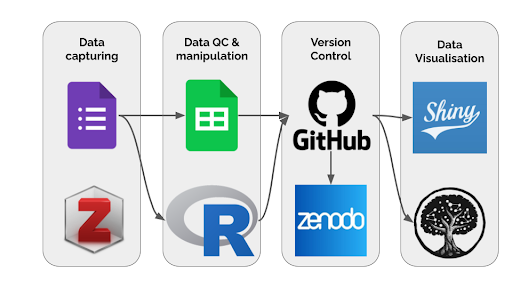
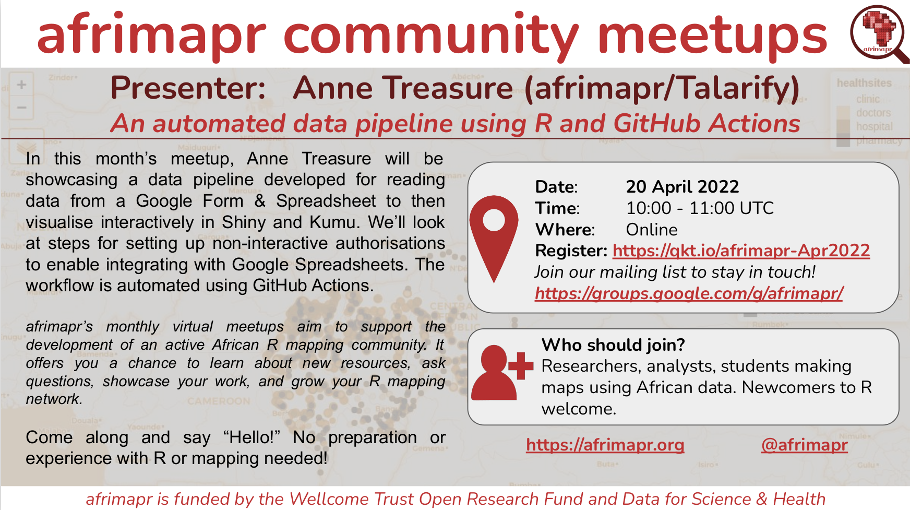

The stakeholder map project aims to collect and share data on Digital Humanities (DH), Computational Social Sciences (CSS) and related activities and initiatives in South Africa. The map includes data on projects, people, publications, datasets, training courses, learning materials, tools, archives, and unclassified records.  The aim is to provide deeper insight into the breadth of activities in this area, facilitate enhanced networking and collaboration, and support the optimal use of resources. The stakeholder map will, for example, support researchers looking for collaborators, help potential students to identify undergraduate and postgraduate training programmes, and highlight gaps and opportunities to funders and institutions.

<em>**Figure 1. Open Source tools used in the Stakeholder Map project** (Anelda van der Walt, & Anne Treasure. (2022). ESCALATOR - Stakeholder map data workflow (v0.1). Zenodo. https://doi.org/10.5281/zenodo.6334089)</em>

#### Submitting your data
 
Data for the stakeholder map is captured using a Google Form and can now be submitted through [this link](https://docs.google.com/forms/d/e/1FAIpQLSeQ4jwaOWP1KPaxo2Kb6DnrqspUs_68Etuh_dQO_-pgCMtpKg/viewform?usp=sf_link). 

Research articles can be added to an [open collection in Zotero](https://www.zotero.org/groups/3866799/dhcssza) to facilitate easy access to publications from the South African community.

#### Software, data workflow, and code

The pipeline is primarily based on open-source software and platforms often used in the open science community. A series of blog posts will be published detailing the data pipeline development. Data is captured via Google Forms linked to a Google Sheet and manipulated using R scripts, available on [GitHub](https://github.com/DHCSSza/stakeholder_map/) and archived in Zenodo. Interactive visualisations include a Shiny app that will allow the community to explore data through a web interface and a Kumu network visualisation. The non-interactive data pipeline is automated using GitHub Actions. 

#### Data visualisations

We make all the data submitted to the database available through interactive visualisations:
- A Shiny App provides access to:
  - **locations** of training, people, and projects on an interactive map; and
  - raw data in **tabular format** that can be sorted and filtered based on search terms.
  - [View map and tables](../stakeholder-map/#shiny-map).
  
- A **social network graph** through the use of Kumu - [view social network graph](../stakeholder-map/#kumu-map).

### Status

Phase one of development has been completed. Phase two will include optimising the data pipeline, bug fixes, and improvements to the scripts and visualisations. 

### Get involved

**Project lead**: [Dr Anne Treasure](../authors/anne_treasure/)

In Q2 2022, community members will have the opportunity to publish their data in the stakeholder map. We are also actively recruiting community members to join the [working group](../groups/stakeholder-map-wg).

### Upcoming Events

#### Official launch of the Stakeholder Map Project

- **Date:** 28 April 2022 - to coincide with [International Day of DH](https://dhcenternet.org/initiatives/day-of-dh/2022)
- **Description:** [Read our blog post]() about the launch of the stakeholder map project.

#### SADiLaR DH Colloquium

- **Date**: 20 July 2022
- **Time**: 10:00 - 11:00 SAST
- **Description**: A brief overview of the stakeholder map project and how stakeholders can contribute to the data collection and use the visualisation platforms to address various questions.

### Past events

#### afrimapr community meetup

- **Date:** 20 April 2022
- **Time:** 12:00 - 13:00 SAST
- **Description:** An overview of the stakeholder map data pipeline and workflow, focusing on using R to integrate the platforms used: from data collection to data visualisation. This presentation is hosted by [afrimapr](https://afrimapr.org/).
- **Link to slides:** [https://doi.org/10.5281/zenodo.6473091](https://doi.org/10.5281/zenodo.6473091)
- **Link to presentation recording:** [https://youtu.be/dAx6CWbraA4](https://youtu.be/dAx6CWbraA4)

