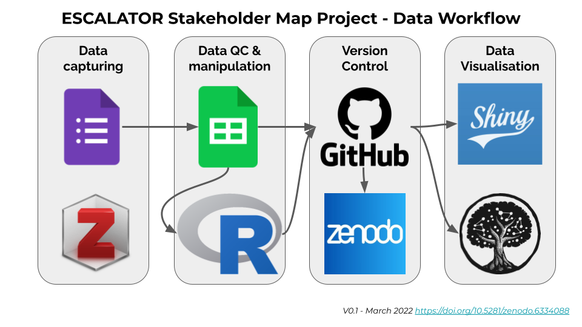

The stakeholder map project aims to collect and share data on Digital Humanities (DH), Computational Social Sciences (CSS) and related activities and initiatives in South Africa. In the long run the map will include data related to:
- South African researchers;
- research and digitisation projects;
- publications;
- digital tools;
- available datasets;
- academic programmes; 
- regular training events;
- related programmes; 
- learning materials and more. 

The aim is to provide deeper insight into the breadth of activities in this area, to facilitate enhanced networking and collaboration, and support the optimal use of resources. The stakeholder map will, for example, support researchers looking for collaborators, help potential students to identify undergraduate and postgraduate training programmes, and highlight gaps and opportunities to funders and institutions.

The pipeline is primarily based on open-source software and platforms often used in the open science community. Data will be captured via Google Forms and manipulated using R scripts, available on GitHub and archived in Zenodo. Interactive visualisations will be published on the ESCALATOR website. These visualisations include a [Shiny app](https://shiny.rstudio.com/) that will allow the community to explore data through a web interface and a [Kumu network visualisation](https://kumu.io/). Research articles can be added to an [open collection in Zotero](https://www.zotero.org/groups/3866799/dhcssza) to facilitate easy access to publications from the South African community.

### Status

The initial design of the data pipeline and workflow for data visualisation has been completed. Development is currently under way.

### Get involved

**Project lead**: [Dr Anne Treasure](../authors/anne_treasure/)

In Q2 2022, community members will have the opportunity to publish their data in the stakeholder map. We are also actively recruiting community members to join the [working group](../groups/stakeholder-map-wg).

### Upcoming Events

#### afrimapr community meetup

- **Date**: 27 April 2022
- **Time**: 12:00 - 13:00 SAST
- **Description**: An overview of the stakeholder map data pipeline and workflow, focusing on using R to integrate the platforms used: from data collection to data visualisation.

#### SADiLaR DH Colloquium

- **Date**: 20 July 2022
- **Time**: 10:00 - 11:00 SAST
- **Description**: A brief overview of the stakeholder map project and how stakeholders can contribute to the data collection and use the visualisation platforms to address various questions.